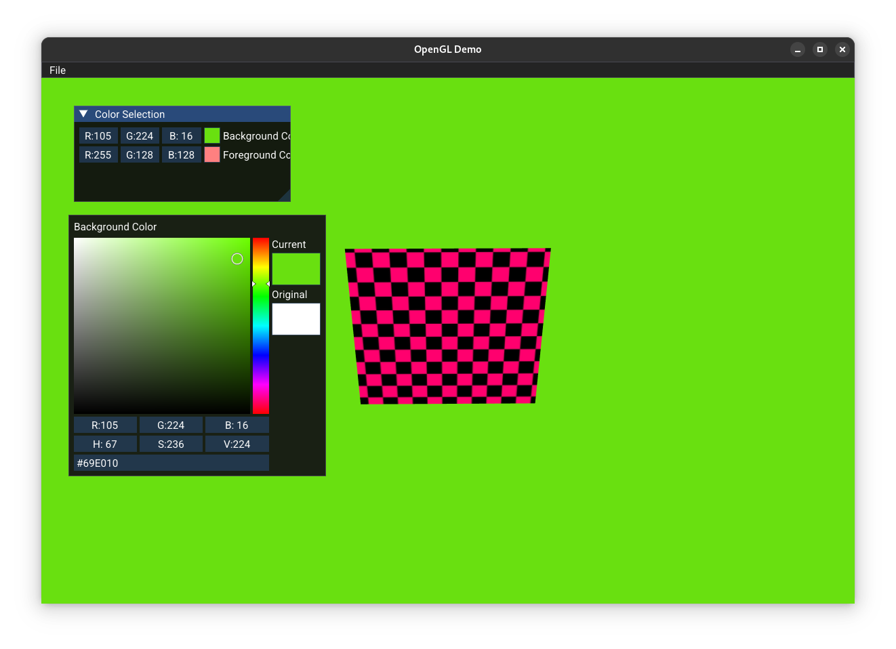

# OpenGL + ImGui Demo

Just a simple C++ demo using OpenGL and [Dear ImGui](https://github.com/ocornut/imgui).

It demonstrates basic 3D shapes, texture loading, and interactive UI controls.




## Building

### Dependencies

- CMake
- GLFW
- GLEW
- GLM (included as a submodule)
- Dear ImGui (included as a submodule)
- ImGuiFileDialog (included as a submodule)

### Build Steps

```sh
git clone --recursive https://github.com/VasilisMylonas/opengl_demo.git
cd opengl_demo
mkdir build && cd build
cmake ..
cmake --build .
```

## Running

```sh
cd opengl_demo
./build/opengl_demo
```

The demo must be run from the project root directory to ensure fonts and shaders are found.

## License

MIT License. See [LICENSE](LICENSE) for details.
